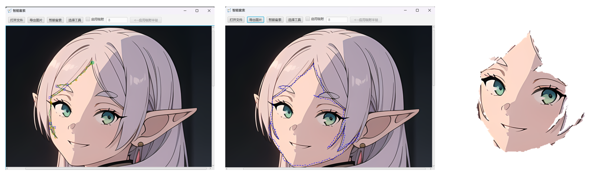

# Intelligent Scissors 项目报告
小组成员：石一凡12313312，邵之航12313311，张岩12313327 \
项目时间：2025年5月11日

## 一、使用说明
我们小组使用`JavaFx`，制作了一个智能套索工具，具体功能如下：
### 1. 用户界面说明
- 运行`Frame.java`文件，打开智能套索GUI窗口。
- 窗口上方是工具栏，有`打开文件`、`导出图片`、`智能套索`、`选择工具`、`启用吸附`等按钮。
- 窗口下方区域为图片展示与操作区域，可显示选择的图片和进行智能套索操作。
### 2. 导入图片
- 鼠标左键单击`导入图片`，即可跳出窗口供用户选择图片文件。
- 可用文件类型包含`JPG`，`JPEG`，`PNG`，`GIF`，`SVG`，`RAW`等多种常见的图片格式。
- 选择图片导入后，图片将在窗口下方显示。
### 3. 智能套索
- 导入图片后，单击智能套索，鼠标将变为十字形状。此时用户可以在下方图片上单击任意一点为套索起点。起点处会生成一正方形标记`SeedPoint`。
- 之后，用户移动鼠标，智能套索将实时计算从上一个`SeedPoint`到此时鼠标位置最佳的贴合图像边缘的路径，并显示在图片上。
- 用户可以单击鼠标左键，来固定这一条生成的路径，并生成下一个`SeedPoint`
- 示例 
### 4. 光标吸附(Cursor Snap)
- 这个功能可以使智能套索中用户在移动鼠标的同时，光标自动吸附到附近的显著边缘上，有利于优化智能套索的效果
- 用户可以通过勾选自动吸附前的选项选择是否开启。
- 在开启自动吸附后可以输入吸附半径。半径越大，每次吸附的位置可能离原鼠标位置越远，可能会导致与用户预期不符。我们推荐用户选择默认的半径值。
### 5. 路径冷却(Path Cooling)
- 通过路径冷却，在移动鼠标的过程中，监测从上一个`SeedPoint`到目前鼠标位置的路径的重合度，
将重合的部分路径进行固定，并自动添加新的`SeedPoint`，从而优化用户操作体验和提高计算效率。
### 7. 撤销与重做
- 撤销操作：任意时刻，用户可以通过单击鼠标右键来撤销上一次操作
- 重做操作：点击`Del`键来开始一个新的套索操作，无需重新导入图片
### 6. 导出图片
- 当选中的套索形成一个封闭图形时，点击`导出图片`，即可将套索内部的区域导出为一张单独的图片，保存在选择的本地位置。
- 没有使用套索或套索不封闭将导出原图片
- 导出时可以选择导出格式

## 二、项目结构
本项目的`src`文件夹中，包含`Frame.java` `ProcessImage.java` `ImageGraph.java` `ProcessMatrix.java` `ComputeMinCostPath.java` `CursorSnap.java`等Java类。这些类的具体功能如下：

- `Frame`类是最核心的部分，它使用`JavaFx`构建窗口，检测用户鼠标操作，绘制`SeedPoint`和生成的切割路径。
- `ProcessImage`将图片转化为RGB矩阵
- `ImageGraph`定义了`Node`类来表示图片上的像素点，在之后的寻路操作中多次使用
- `ProcessMatrix`在矩阵上操作，计算矩阵中的$f_Z, f_G, f_D$等信息，用于计算边权
- `ComputeMinCostPath`使用 Dijkstra 算法计算最短路，并返回路径点给`Frame`使其绘制路径
- `CursorSnap`类寻找给定范围内超过设定阈值的显著边缘，返回给`Frame`类使鼠标吸附

## 三、算法实现
### 1. 图像预处理和局部成本计算
- 特征提取：首先把图像转换为RGB矩阵。通过计算每个像素的以下特征，来构建局部成本函数：
  - Laplacian过零点($f_Z$)：检测边缘位置，零交叉点成本为0，否则为1。
  - 梯度幅值($f_G$)：衡量边缘强度，通过梯度算子（如Sobel）计算，并归一化为逆线性函数。高梯度对应低成本。
  - 梯度方向($f_D$)：确保边界平滑性，通过相邻像素梯度方向的余弦相似性计算成本。
- 局部成本函数：$$l(p,q) = \omega_Zf_Z(q) + \omega_Gf_G(p,q) + \omega_Df_D(q)$$ 其中权重 $\omega_Z = \omega_D = 0.43, \omega_G = 0.14$
- 假设图像分辨率为`n*m`，则预处理的时间复杂度为$O(nm)$
### 2. Dijkstra算法求解最短路
- 从`SeedPoint`出发，计算到目标像素点的最小累计成本路径。相邻的八个像素点视为连边。
- 使用优先队列`Priority Queue`优化，每次取出当前最小成本像素，标记为已访问，并进行扩展。如有更新，则把下一个节点也加入优先队列。
- 优先队列为空时，生成从`SeedPoint`到目标像素点的最小成本路径，在图像上画出即为可能的边缘。
- Dijkstra算法的时间复杂度为 $O(nm\log(nm))$
### 3. Cursor Snap 光标吸附
- 从当前光标的位置开始，在用户设定的范围`W`内，寻找超过设定阈值的梯度最大值，作为吸附的目标点，即
$$(x',y') = argmax_{i,j \in W}(G(i,j))$$
- 如果窗口内存在梯度幅值明显高于周围像素的点（即边缘点），则将光标吸附到该点。
- 如果窗口内梯度变化平缓（无明显边缘），则不进行吸附，保持原光标位置。
- 若用户设定的吸附半径为`r`，Cursor Snap的时间复杂度为 $O(r^2)$
### 4. Path Cooling 路径冷却
- 在用户光标的位置与当前种子点的最短路上，按照一定的规则添加种子点。
- 判断条件包含路径长度、路径中经过点的梯度、用户光标附近的梯度。生成一个候选点List，然后从里面挑最优的一个，作为自动生成的种子点。
### 5. 提取选中区域
- 扫描线算法：接收一段闭合路径，返回其中包含的图部分（`WritableImage`类型）
- 实现：首先构造一个空的`WritableImage`对象（蒙版），根据输入的闭合路径构建边表`Map(yMin，List<Edge>)`，
构建活跃边的List，然后从Map中最小的`yMin`开始遍历边表到最大的`yMin`，遍历过程中往活跃边添加新边并移除过期边，
再对其按`x`排序后填充扫描线，最后更新活跃边的`x`值，遍历完成后返回蒙版。

## 四、总结与展望
该智能套索工具已经能够完成基本套索操作，但是对边缘的识别精度、运算的效率还有提升空间。
未来可以通过调整边权计算使用的算子来着重提升边缘识别算法的精度，以及考虑用动态规划或启发式算法来进行寻路，从而提升该智能套索工具的实用性。